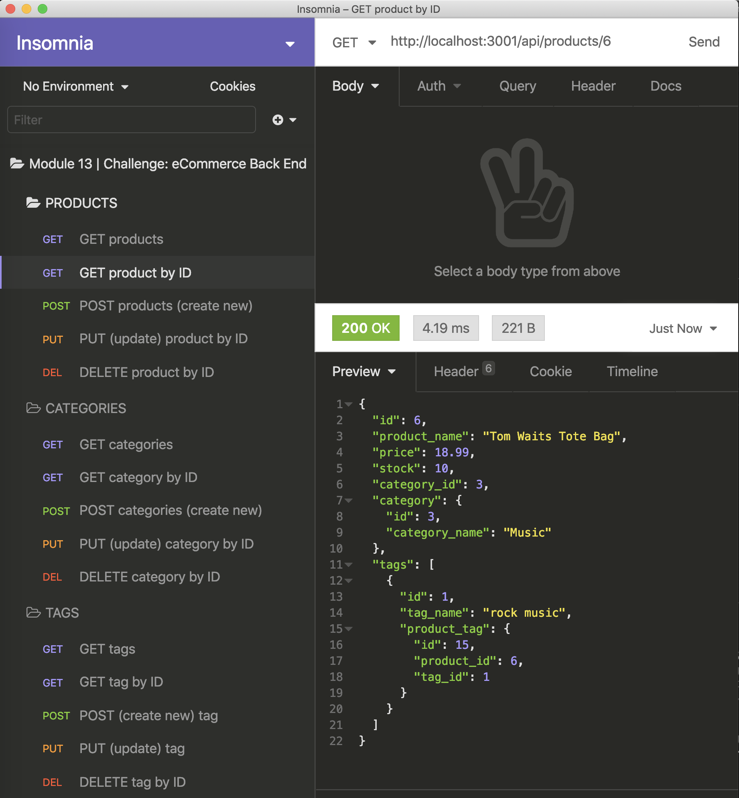

# eCommerce Back End (powered by Sequelize)
  


  ## Table of Contents
  * [Description](#description)
  * [Installation](#installation)
  * [Usage](#usage)
  * [License](#license)
  * [Contribution Guidelines](#contribution-guidelines)
  * [Questions](#questions)
  

  ## Description  
  View, manage, and manipulate your eCommerce inventory database with the help of Express.js and Sequelize. 

  ## Installation  
  After cloning the application, download the following dependencies in the CLI: 
  <br>
  ```npm install express sequelize mysql2``` 
  <br>
  ```npm install --save sequelize```
  <br>
  ```npm install bcrypt```
  <br>
  ```npm install dotenv```
  <br>

  ## Usage
  - Initialize the application with ```npm start```. 
  - Seed the database with test data using the custom script ```npm run seed```. 
  - Watch a [comprehensive tutorial video here](https://drive.google.com/file/d/1DBFIatJ9ehGcNjRv0FBpVtGRUvkOPYgR/view).  

  

  ## License
  This project is covered under Unlicense.

  ## Contribution Guidelines
  It's chaos; be kind. 

  ## Questions
  Please direct all inquiries to [jessicajernigan](https://github.com/jessicajernigan) via email at: [jernigan.jessica.leigh@gmail.com](mailto:jernigan.jessica.leigh@gmail.com?subject=Question%20About%20eCommerce%20Back%20End%20(powered%20by%20Sequelize))

